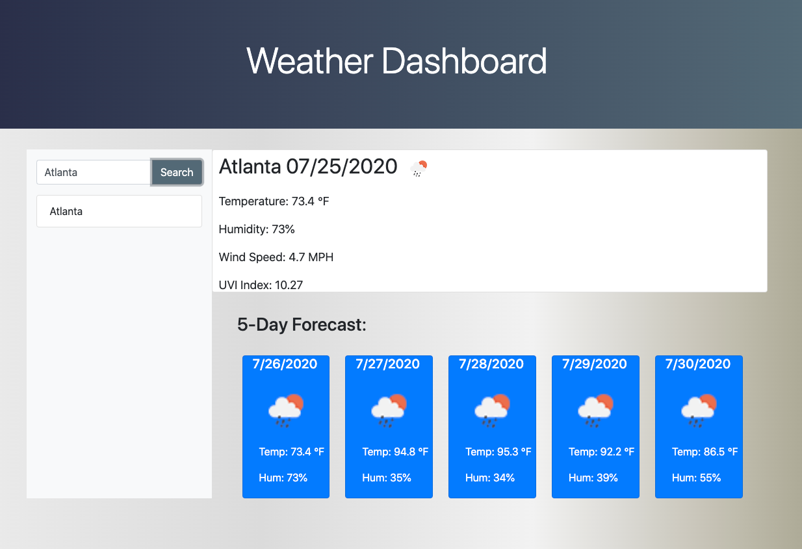

## 06 Weather Dashboard

In this app, the user enters the name of a city in the search field, then clicks the search button. The app will display the current weather conditions in that city, including temperature, humidity, UV index, and a picture representing whether it is clear, cloudy, raining, etc. Additionally, a 5-day forecast for that city is displayed below the current conditions showing similar information (predicted at 12:00 PM on each day).

---




## Contributors
Jonathan Echevarria j.eche589@gmail.com

## App functionality

GIVEN a weather dashboard with form inputs
WHEN I search for a city
THEN I am presented with current and future conditions for that city and that city is added to the search history
WHEN I view current weather conditions for that city
THEN I am presented with the city name, the date, an icon representation of weather conditions, the temperature, the humidity, the wind speed, and the UV index
WHEN I view future weather conditions for that city
THEN I am presented with a 5-day forecast that displays the date, an icon representation of weather conditions, the temperature, and the humidity
WHEN I click on a city in the search history
THEN I am again presented with current and future conditions for that city
WHEN I open the weather dashboard
THEN I am presented with the last searched city forecast
```
